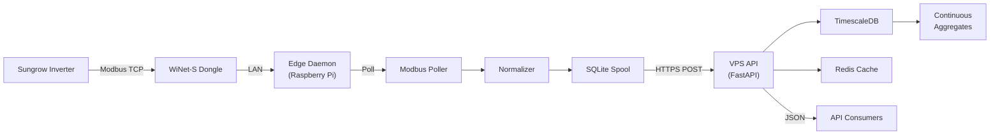

# Architecture Overview

Sungrow-to-VPS is a two-tier telemetry pipeline that collects data from a Sungrow hybrid inverter and delivers it to a cloud API for storage and querying.

## Data Flow

## Components

### Edge Daemon

A Python asyncio service running on a Raspberry Pi (or any Linux host with network access to the inverter). It performs two concurrent jobs:

- **Poll loop** -- reads Modbus TCP registers from the Sungrow inverter via the WiNet-S dongle at a configurable interval, normalizes raw register values into a `SungrowSample`, and enqueues the sample into a local SQLite spool database.
- **Upload loop** -- dequeues batches of spooled samples and POSTs them to the VPS API over HTTPS. Failed uploads are retried with exponential backoff.

The SQLite spool decouples polling from uploading, so data collection continues even when the VPS is unreachable.

### VPS API (FastAPI)

A FastAPI application running in a Docker container behind a Caddy reverse proxy. It exposes four route groups:

| Route | Purpose |
|-------|---------|
| `POST /v1/ingest` | Accepts batches of telemetry samples |
| `GET /v1/realtime` | Returns the latest sample for a device |
| `GET /v1/series` | Returns time-bucketed rollup data |
| `GET /health` | Internal Docker health check |

### TimescaleDB

PostgreSQL with the TimescaleDB extension. The `sungrow_samples` hypertable stores raw samples with a composite primary key `(device_id, ts)`. Three continuous aggregate views provide pre-computed rollups at hourly, daily, and monthly granularity.

### Redis

An in-memory cache for the `/v1/realtime` endpoint. The most recent sample for each device is stored under the key `realtime:{device_id}` with a configurable TTL. Redis is best-effort -- if it is unavailable, the API falls back to a direct database query.

### Caddy

A reverse proxy that terminates TLS and forwards requests to the FastAPI container. It automatically provisions and renews Let's Encrypt certificates. The `/health` endpoint is not proxied through Caddy and is only accessible within the Docker network.

## Design Principles

### No Data Loss

The SQLite spool on the edge ensures that samples are persisted locally before any upload attempt. Samples remain in the spool until the VPS confirms receipt. If the VPS is unreachable, the spool grows on disk and drains automatically once connectivity is restored.

### Idempotent Ingestion

The `POST /v1/ingest` endpoint uses `ON CONFLICT (device_id, ts) DO NOTHING` when inserting into TimescaleDB. This means the same batch can be submitted multiple times without creating duplicate rows. The edge uploader can safely retry failed uploads without any risk of data corruption.

### HTTPS Only

All traffic between the edge daemon and the VPS is encrypted via HTTPS. Caddy handles TLS termination with automatic certificate provisioning. Bearer tokens are never transmitted in cleartext.
