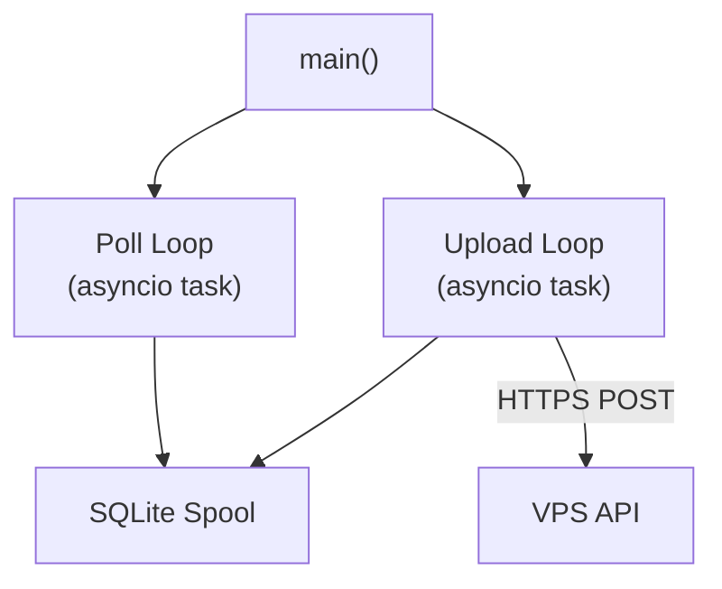

# Edge Daemon

The edge daemon is a Python asyncio service that runs on a Raspberry Pi (or any Linux host with LAN access to the inverter). It polls Modbus registers from the Sungrow inverter, normalizes them into telemetry samples, spools them locally in SQLite, and uploads batches to the VPS API over HTTPS.

## Concurrency Model

The daemon runs two concurrent asyncio tasks:



Both tasks share the same SQLite spool. Each task has its own `try/except` wrapper -- if one task crashes, the other continues running independently.

## Poll Loop

The poll loop executes on a fixed interval defined by `POLL_INTERVAL_S` (default: 5 seconds).

Each iteration performs:

1. **Read registers** -- `Poller.poll()` reads all register groups from the inverter via Modbus TCP. Groups are read sequentially with a configurable `INTER_REGISTER_DELAY_MS` pause between reads to avoid overwhelming the WiNet-S dongle.
2. **Normalize** -- Raw register values are converted into a `SungrowSample` with engineering units (e.g., raw tenths-of-kWh to kWh, applying scaling factors).
3. **Enqueue** -- The normalized sample is inserted into the SQLite spool via `spool.enqueue()`.

If the Modbus read fails (e.g., timeout, connection refused), the error is logged and the loop sleeps until the next interval. No sample is enqueued on failure.

## Upload Loop

The upload loop executes on a fixed interval defined by `UPLOAD_INTERVAL_S` (default: 10 seconds).

Each iteration performs:

1. **Dequeue batch** -- Reads up to `BATCH_SIZE` samples from the SQLite spool.
2. **POST to VPS** -- Sends the batch as JSON to `POST /v1/ingest` with the Bearer token in the `Authorization` header.
3. **Confirm** -- On a successful response, the uploaded samples are deleted from the spool.
4. **Retry on failure** -- On HTTP errors or connection failures, samples remain in the spool for the next attempt.

### Exponential Backoff

The `Uploader` class implements exponential backoff on consecutive upload failures. After each failure, the wait time doubles (up to a maximum cap). On a successful upload, the backoff resets to zero. This prevents hammering a temporarily unavailable VPS.

## Modbus Poller

The poller reads register groups defined in `edge/src/registers.py`. Registers are organized into five contiguous groups:

| Group | Address Range | Key Registers |
|-------|--------------|---------------|
| device | 4990--5000 | serial_number, device_type_code |
| pv | 5004--5018 | total_dc_power, daily_pv_generation |
| export | 5083--5084 | export_power |
| load | 13008--13017 | load_power, grid_power |
| battery | 13022--13027 | battery_power, battery_soc, battery_temperature |

Each group is read with a single `read_input_registers` call (function code 0x04). A delay of `INTER_REGISTER_DELAY_MS` milliseconds is inserted between group reads.

## Graceful Shutdown

On receiving `SIGTERM` or `SIGINT`:

1. The daemon signals both asyncio tasks to stop.
2. Each task finishes its current iteration (it does not abort mid-read or mid-upload).
3. A final upload flush is attempted to drain any remaining spooled samples.
4. The process exits cleanly.

## Health File

The edge daemon writes a JSON health file to `/data/health.json` after each successful poll and upload. The file contains:

```json
{
  "last_poll_ts": "2026-02-15T10:30:00Z",
  "last_upload_ts": "2026-02-15T10:30:05Z",
  "spool_count": 3
}
```

| Field | Description |
|-------|-------------|
| `last_poll_ts` | Timestamp of the most recent successful Modbus poll |
| `last_upload_ts` | Timestamp of the most recent successful upload |
| `spool_count` | Number of samples currently queued in the SQLite spool |

An external monitoring tool (or a simple cron script) can read this file to detect stale polls or growing spool backlogs.

## Structured Logging

All log output is structured JSON, one object per line:

```json
{"ts": "2026-02-15T10:30:00.123Z", "level": "INFO", "logger": "poller", "msg": "Poll completed", "pv_power_w": 3450.5}
```

Key fields:

| Field | Description |
|-------|-------------|
| `ts` | ISO 8601 timestamp with milliseconds |
| `level` | Log level: DEBUG, INFO, WARNING, ERROR |
| `logger` | Component name (poller, uploader, spool, main) |
| `msg` | Human-readable message |

Additional context fields are included as appropriate (e.g., `pv_power_w` on poll success, `batch_size` on upload, `error` on failures).
