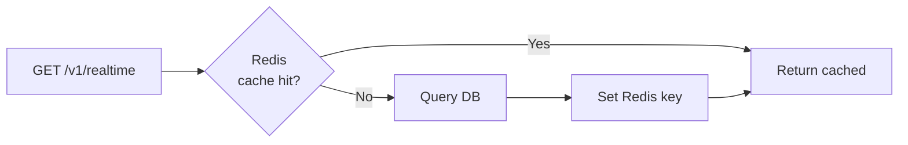

# VPS Server

The VPS server is a FastAPI application that receives telemetry from the edge daemon, stores it in TimescaleDB, caches the latest values in Redis, and serves query endpoints for API consumers.

## Application Structure

The FastAPI app is composed of four routers:

| Router | Path | Purpose |
|--------|------|---------|
| health | `GET /health`, `GET /` | Internal health check |
| ingest | `POST /v1/ingest` | Batch sample ingestion |
| realtime | `GET /v1/realtime` | Latest sample per device |
| series | `GET /v1/series` | Historical time-bucketed rollups |

### Startup Sequence

On application startup:

1. **Validate environment variables** -- required variables (`DATABASE_URL`, `REDIS_URL`, `DEVICE_TOKENS`) are checked. Missing variables cause immediate exit with a clear error message.
2. **Parse DEVICE_TOKENS** -- the comma-separated `token:device_id` string is parsed into an internal mapping.
3. **Create BearerAuth** -- the auth dependency is instantiated with the parsed token map and uses constant-time comparison for token validation.
4. **Log config summary** -- a startup log entry records all non-secret configuration values (tokens are omitted).

## TimescaleDB Schema

### Hypertable: `sungrow_samples`

The primary data table is a TimescaleDB hypertable with a composite primary key `(device_id, ts)`.

| Column | Type | Description |
|--------|------|-------------|
| `device_id` | `TEXT` | Device identifier |
| `ts` | `TIMESTAMPTZ` | Sample timestamp (UTC) |
| `pv_power_w` | `DOUBLE PRECISION` | PV array output power (W) |
| `pv_daily_kwh` | `DOUBLE PRECISION` | Daily PV generation (kWh), nullable |
| `battery_power_w` | `DOUBLE PRECISION` | Battery charge/discharge power (W) |
| `battery_soc_pct` | `DOUBLE PRECISION` | Battery state of charge (%) |
| `battery_temp_c` | `DOUBLE PRECISION` | Battery temperature (C), nullable |
| `load_power_w` | `DOUBLE PRECISION` | Household load power (W) |
| `export_power_w` | `DOUBLE PRECISION` | Grid export power (W) |
| `sample_count` | `INTEGER` | Number of raw samples (default 1) |

The hypertable is partitioned by `ts` with automatic chunk management by TimescaleDB.

### Continuous Aggregates

Three materialized views provide pre-computed rollups:

| View | Bucket Size | Refresh Policy |
|------|-------------|----------------|
| `sungrow_hourly` | 1 hour | Continuous refresh |
| `sungrow_daily` | 1 day | Continuous refresh |
| `sungrow_monthly` | 1 month | Continuous refresh |

Each aggregate computes:

- `avg_pv_power_w` -- average PV power
- `max_pv_power_w` -- peak PV power
- `avg_battery_power_w` -- average battery power
- `avg_battery_soc_pct` -- average battery state of charge
- `avg_load_power_w` -- average load power
- `avg_export_power_w` -- average export power
- `sample_count` -- total number of raw samples in the bucket

### Aggregation Fallback

If a continuous aggregate view does not exist (e.g., in a fresh development environment), the series endpoint catches the `ProgrammingError` (PostgreSQL error code `42P01` -- undefined table) and falls back to querying the raw `sungrow_samples` table with `time_bucket()` aggregation. This allows the API to function without the aggregate views at the cost of slower queries.

## Redis Caching Layer

The realtime endpoint uses Redis as a read-through cache:

**Cache key format:** `realtime:{device_id}`

**TTL:** Configurable via `CACHE_TTL_S` (default: 5 seconds).

### Best-Effort Redis

Redis is treated as best-effort infrastructure. If Redis is unavailable (connection refused, timeout, etc.):

- Cache reads fall back to a direct database query.
- Cache writes are silently skipped.
- Redis errors are logged at WARNING level but do not cause request failures.

This design ensures the API remains fully functional even during Redis outages, at the cost of higher database load.
